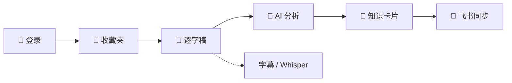
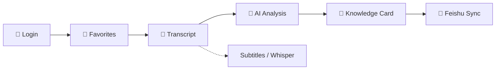

<div align="center">

# 📚 Unarchive · 解压收藏夹

### *将视频收藏转化为个人知识库*
### *Turn Video Favorites into a Personal Knowledge Base*

<br>

> 收藏了上千个视频，真正回头看过的有几个？
>
> *Thousands of videos bookmarked — how many have you actually revisited?*

<br>

[](https://www.python.org/)
[](https://www.gradio.app/)
[](https://playwright.dev/)
[](https://github.com/openai/whisper)
[]()

<br>

[**🇨🇳 中文**](#-中文) &nbsp;|&nbsp; [**🇬🇧 English**](#-english)

</div>

---

### 为什么需要它？ / Why This?

| | 😩 没有 Unarchive | 😎 有了 Unarchive |
|:---:|:---:|:---:|
| **逐字稿** | 手动听写，费时费力 | 自动提取字幕 / Whisper 转写 |
| **内容理解** | 看完就忘，只记得标题 | AI 生成摘要、关键词、核心要点 |
| **知识管理** | 收藏列表吃灰，再也找不到 | 结构化知识卡片，可搜索可回顾 |
| **跨平台** | B站、抖音各自为政 | 统一入口，一键同步到飞书文档 |

---

<a id="-中文"></a>

## 🇨🇳 中文

### 💡 这是什么？

**Unarchive（解压收藏夹）** 自动完成「**看视频 → 提取文字 → AI 分析 → 整理成知识**」的完整链路。你只需登录平台、选择收藏夹，剩下的全部自动完成。



### ✨ 核心特性

| | | |
|:---:|:---:|:---:|
| 🎬 **多平台**<br>Bilibili · 抖音 | 📝 **智能转写**<br>字幕优先 + Whisper 兜底 | 🤖 **AI 分析**<br>DeepSeek · 通义千问 |
| 📖 **知识卡片**<br>摘要 · 关键词 · 要点 | 🔄 **飞书同步**<br>一键同步 · 增量去重 | 🖥️ **Web 界面**<br>Gradio 实时进度 |

### 📋 知识卡片示例

每个视频处理后，会生成如下结构化知识卡片：

```json
{
  "video_id": "BV1Ab4y1r7bo",
  "title": "为什么你的时间总是不够用？",
  "author": "某UP主",
  "platform": "Bilibili",
  "summary": "视频从三个维度分析了时间管理的常见误区...",
  "keywords": ["时间管理", "效率", "优先级", "番茄工作法"],
  "key_points": [
    "大多数人的时间管理问题本质是优先级问题",
    "番茄工作法的核心不是计时而是单任务专注",
    "学会说'不'比学会规划更重要"
  ]
}
```

### 🚀 快速开始

**环境要求：** Python 3.10+ · FFmpeg · 可选 CUDA GPU（加速 Whisper）

```bash
# 克隆 & 安装
git clone <repo-url> && cd Unarchive
python -m venv venv && venv\Scripts\activate   # Windows
pip install -r requirements.txt
playwright install chromium

# 配置 & 运行
cp .env.example .env   # 编辑 .env 填入 API Keys
python app.py          # 访问 http://127.0.0.1:7860
```

**配置项（`.env`）：**

| 变量 | 说明 | 默认值 |
|------|------|--------|
| `LLM_API_KEY` | 大模型 API Key | *必填* |
| `LLM_BASE_URL` | API 地址 | `https://api.deepseek.com` |
| `LLM_MODEL` | 模型名称 | `deepseek-chat` |
| `FEISHU_APP_ID` | 飞书 App ID | *可选，同步飞书时填写* |
| `FEISHU_APP_SECRET` | 飞书 App Secret | *可选，同步飞书时填写* |
| `WHISPER_MODEL` | Whisper 模型 | `small` |

<br>

---

<a id="-english"></a>

## 🇬🇧 English

### 💡 What is this?

**Unarchive** automates the full pipeline: **Watch → Transcribe → Analyze → Organize**. Just log in, pick your favorites, and let it run.



### ✨ Key Features

| | | |
|:---:|:---:|:---:|
| 🎬 **Multi-Platform**<br>Bilibili · Douyin | 📝 **Smart Transcription**<br>Subtitles + Whisper fallback | 🤖 **AI Analysis**<br>DeepSeek · Qwen |
| 📖 **Knowledge Cards**<br>Summary · Keywords · Points | 🔄 **Feishu Sync**<br>One-click · Incremental | 🖥️ **Web UI**<br>Gradio real-time progress |

### 📋 Knowledge Card Example

Each video produces a structured knowledge card like this:

```json
{
  "video_id": "BV1Ab4y1r7bo",
  "title": "Why You Never Have Enough Time?",
  "author": "Some Creator",
  "platform": "Bilibili",
  "summary": "The video analyzes common time management mistakes from three perspectives...",
  "keywords": ["time management", "productivity", "prioritization", "pomodoro"],
  "key_points": [
    "Most time management problems are actually priority problems",
    "The core of Pomodoro is single-task focus, not timing",
    "Learning to say 'no' matters more than learning to plan"
  ]
}
```

### 🚀 Quick Start

**Prerequisites:** Python 3.10+ · FFmpeg · Optional CUDA GPU (for Whisper)

```bash
# Clone & install
git clone <repo-url> && cd Unarchive
python -m venv venv && venv\Scripts\activate   # Windows
pip install -r requirements.txt
playwright install chromium

# Configure & run
cp .env.example .env   # Edit .env with your API Keys
python app.py          # Visit http://127.0.0.1:7860
```

**Configuration (`.env`):**

| Variable | Description | Default |
|------|------|--------|
| `LLM_API_KEY` | LLM API Key | *Required* |
| `LLM_BASE_URL` | API Base URL | `https://api.deepseek.com` |
| `LLM_MODEL` | Model name | `deepseek-chat` |
| `FEISHU_APP_ID` | Feishu App ID | *Optional, for Feishu sync* |
| `FEISHU_APP_SECRET` | Feishu App Secret | *Optional, for Feishu sync* |
| `WHISPER_MODEL` | Whisper model size | `small` |

<br>

---

### 🏗️ 项目结构 / Project Structure

```
Unarchive/
├── app.py                  # Gradio 主入口 / Main entry
├── config.py               # 配置 / Config (Pydantic + dotenv)
├── .env.example            # 环境变量模板 / Env template
├── requirements.txt        # 依赖 / Dependencies
├── data/
│   ├── transcripts/        # 逐字稿 / Transcripts
│   ├── audio_cache/        # 音频缓存 / Audio cache
│   └── knowledge_base/     # 知识卡片 / Knowledge cards
├── src/
│   ├── platforms/          # 平台适配 / Adapters
│   │   ├── bilibili.py
│   │   └── douyin.py
│   ├── transcript/         # 逐字稿 / Transcripts
│   │   ├── subtitle.py     # 字幕 / Subtitle parser
│   │   └── whisper_asr.py  # 语音识别 / Whisper ASR
│   ├── analyzer/           # AI 分析 / Analysis
│   │   └── llm_analyzer.py
│   ├── sync/               # 同步 / Sync
│   │   └── feishu.py
│   └── utils/
└── prompts/                # Prompt 模板 / Templates
    ├── analyze.txt
    └── summarize.txt
```

### 🛠️ 技术栈 / Tech Stack

| 组件 / Component | 技术 / Technology |
|:---:|------|
| 🖥️ 界面 / UI | **Gradio 4.x** |
| 🌐 浏览器 / Browser | **Playwright** |
| 🎵 音频 / Audio | **yt-dlp** + **OpenAI Whisper** |
| 🌍 网络 / HTTP | **httpx** |
| ⚙️ 配置 / Config | **Pydantic** + **python-dotenv** |
| 🧠 模型 / AI | **DeepSeek** / **Qwen** (OpenAI-compatible) |

<br>

---

<div align="center">

**⭐ 觉得有用？给项目点个星吧！ / Find it useful? Give it a star!**

</div>
