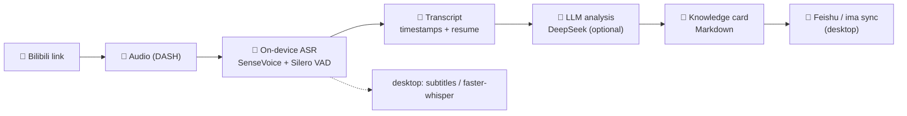

<div align="center">

# 📚 Unarchive · 解压收藏夹

### Turn Video Favorites into a Personal Knowledge Base

> Thousands of videos bookmarked — how many have you actually revisited?
>
> 收藏了上千个视频，真正回头看过的有几个？

<br>

[](https://github.com/YAHU2024/Unarchive/releases)
[](https://github.com/YAHU2024/Unarchive)
[](https://www.python.org/)
[](https://kotlinlang.org/)
[](LICENSE)
[](https://github.com/YAHU2024/Unarchive/releases)
[](https://github.com/YAHU2024/Unarchive)

<br>

[**🇨🇳 中文**](README.zh-CN.md) &nbsp;|&nbsp; [**🇬🇧 English**](#english)

</div>

---

## What is Unarchive?

**Unarchive** turns your video favorites into structured, searchable knowledge.
Paste a Bilibili link on Android — or run the desktop app — and Unarchive
handles the rest: fetch audio → transcribe on device → analyze with AI →
export a knowledge card.

**Local-first. Your videos stay yours.** Transcription runs on your phone or
PC, no cloud account required.

<br>

| | | |
|:---:|:---:|:---:|
|  |  |  |
| **① Paste a Bilibili link**<br/><sub>engine picker &amp; local model status below</sub> | **② Manage models &amp; API key**<br/><sub>bundled ASR models install locally, SHA-256 verified</sub> | **③ Timestamped transcript**<br/><sub>copy, share, rerun, or export a knowledge card</sub> |

<p align="center"><em>Android app: paste a link → on-device transcript → knowledge card. Everything runs locally.</em></p>

---

## 🚀 Quick Experience

### 📱 Android — try it in 1 minute

1. Grab the per-ABI APK for your phone from **[GitHub Releases](https://github.com/YAHU2024/Unarchive/releases)** (Android 8.0+, ~184 MB arm64 with bundled ASR models, signed; universal ~274 MB available too)
2. Install, open, paste a Bilibili link
3. First run installs the bundled ASR models locally (no network needed)
4. Get a timestamped transcript → export a Markdown knowledge card

### 🖥️ Desktop — run with 2 commands

```bash
pip install -r requirements.txt && playwright install chromium
python app.py          # visit http://127.0.0.1:7860
```

---

## ✨ Highlights

| | | |
|:---:|:---:|:---:|
| 📱 **Mobile-first Android app**<br>Bilibili → on-device transcript | 🧠 **On-device ASR**<br>SenseVoice int8 + Silero VAD, no cloud | 🏷️ **Knowledge cards**<br>Markdown, Obsidian-friendly |
| 🤖 **AI-enhanced cards**<br>DeepSeek summary · story line · key points | 🔄 **Multi-target sync**<br>Feishu · ima (desktop) | 🔒 **Local-first & private**<br>Models bundled, SHA-256 verified |
| 📼 **4-hour input**<br>Streaming pipeline, resume checkpoints | 🎬 **Multi-platform**<br>Bilibili · Douyin (desktop) | 📤 **Share anywhere**<br>Export / copy / system share |

---

## 📖 Knowledge Card Example

Every video becomes a structured Markdown card — import it into Obsidian or any
Markdown note app:

```markdown
---
title: "普通人健身100天，变化有多大？"
author: "何同学工作室"
source: https://www.bilibili.com/video/BV1vxuq6pEsd
transcribed: 2026-08-13
---

# 普通人健身100天，变化有多大？

## 摘要
该视频记录了一位瘦弱男性通过100天增肌计划的训练变化……

## 故事线
### 00:00–00:30 目标设定与计划制定
- [00:00](https://www.bilibili.com/video/BV1vxuq6pEsd?t=0) 主角小鹿身材瘦弱，体重97斤，设定100天健身目标。
### 00:30–01:30 初始体能测试与开始训练
- [00:30](https://www.bilibili.com/video/BV1vxuq6pEsd?t=30) 测试初始：30公斤深蹲只能做半个……

## 关键要点
- 制定100天增肌计划，训练分胸背和臀腿，三天一循环……

## 转录全文
[00:00](https://www.bilibili.com/video/BV1vxuq6pEsd?t=0) 这是我弟1.73的个子体重却只有97斤……
```

Each chapter embeds a **screenshot of the video at that timestamp**, so you can
jump back to the exact moment. See the
[full example card](docs/examples/普通人健身100天，变化有多大？.md) (with
embedded screenshots).

> 💡 Timestamps are clickable links back to the Bilibili video at that moment.

---

## 🏗️ Architecture



**Android**: local-first, all processing on device (ASR, VAD, card export).
**Desktop**: full pipeline with platform scrapers, faster-whisper, and
Feishu / ima synchronization.

---

## 🎯 Platform Support

| Platform | Android | Desktop |
|:---|:---:|:---:|
| Bilibili | ✅ | ✅ |
| Douyin | planned | ✅ |
| Xiaohongshu | — | planned (stub only) |
| Feishu / ima sync | planned | ✅ |

---

## 📦 Quick Start

### Android

Requirements: Android 8.0+ · ~280 MB free space

```text
1. Download unarchive-v0.1.0.apk from GitHub Releases
2. Install (allow unknown sources if prompted)
3. Paste a Bilibili link and tap "Process video"
4. First launch installs bundled models into private storage (SHA-256 verified)
```

Build from source: see [`android/README.md`](android/README.md)
(JDK 17 + Android SDK Platform 35 required).

### Desktop

**Requirements:** Python 3.10+ · FFmpeg · Google Chrome · optional CUDA GPU

```bash
git clone https://github.com/YAHU2024/Unarchive.git && cd Unarchive
python -m venv venv && venv\Scripts\activate   # optional
pip install -r requirements.txt
playwright install chromium
cp .env.example .env                            # add your API keys
python app.py                                   # visit http://127.0.0.1:7860
```

> 💡 **CDP Auto-Connect:** the desktop app finds and launches Chrome,
> reusing your existing login session (no QR scanning). Set `CHROME_PATH` for
> a custom Chrome, `CHROME_HEADLESS=1` for headless servers. All state lives
> under `DATA_DIR` (default `./data`) — set one variable to relocate
> cookies, logs, cards, and sync state.

Environment variables: see [`.env.example`](.env.example) for the full list.

---

## 🛠️ Tech Stack

| Component | Technology |
|:---:|---|
| 📱 Android app | **Kotlin · Jetpack Compose · sherpa-onnx** |
| 🎵 On-device ASR | **SenseVoice int8 · Silero VAD** (sherpa-onnx) |
| 🤖 LLM | **DeepSeek** (OpenAI-compatible) |
| 🖥️ Desktop UI | **Gradio 6.x** |
| 🌐 Desktop browser | **Playwright + Chrome CDP** |
| 🎵 Desktop ASR | **yt-dlp + faster-whisper (CTranslate2)** |
| 🔄 Desktop sync | **Feishu · ima (OpenAPI)** |

---

## 🙏 Open Source Acknowledgments

This project stands on the shoulders of these open-source projects —
many thanks to all contributors:

| Project | Used for | License |
| --- | --- | --- |
| [Gradio](https://github.com/gradio-app/gradio) | Desktop web UI | Apache-2.0 |
| [Playwright](https://github.com/microsoft/playwright) | Browser automation | Apache-2.0 |
| [yt-dlp](https://github.com/yt-dlp/yt-dlp) | Media retrieval | Unlicense |
| [faster-whisper](https://github.com/SYSTRAN/faster-whisper) | Desktop ASR | MIT |
| [CTranslate2](https://github.com/OpenNMT/CTranslate2) | Inference backend | MIT |
| [httpx](https://github.com/encode/httpx) | HTTP client | BSD-3-Clause |
| [Pydantic](https://github.com/pydantic/pydantic) | Config & validation | MIT |
| [sherpa-onnx](https://github.com/k2-fsa/sherpa-onnx) | On-device ASR engine | Apache-2.0 |
| [SenseVoice](https://github.com/FunAudioLLM/SenseVoice) | ASR model | FunASR Model License v1.1 |
| [Silero VAD](https://github.com/snakers4/silero-vad) | Voice activity detection | MIT |
| [ONNX Runtime](https://github.com/microsoft/onnxruntime) | Inference runtime | MIT |
| [AndroidX / Jetpack Compose](https://developer.android.com/jetpack) | Android UI & runtime | Apache-2.0 |
| [Kotlin](https://kotlinlang.org/) | Android language | Apache-2.0 |
| [SubtitleEditforAndroid](https://github.com/nihaina/SubtitleEditforAndroid) | Reference (model management flow) | GPL-3.0 |

Full inventory and license texts: [`THIRD_PARTY_NOTICES.md`](THIRD_PARTY_NOTICES.md).
The Android APK also bundles every license text (in-app "查看开源许可").

---

## 🗺️ Roadmap

- **Android**: Douyin support, Feishu sync, on-device performance tuning
- **Desktop**: maintained alongside; platform scrapers and sync live here first
- Detailed priorities live in the project's private development documents

---

## License

Unarchive is licensed under the [GNU General Public License v3.0](LICENSE).
Third-party components retain their own licenses — see
[`THIRD_PARTY_NOTICES.md`](THIRD_PARTY_NOTICES.md).

<br>

<div align="center">

**⭐ Found it useful? Give the project a star!**
<br>
**⭐ 觉得有用？给项目点个星吧！**

</div>
