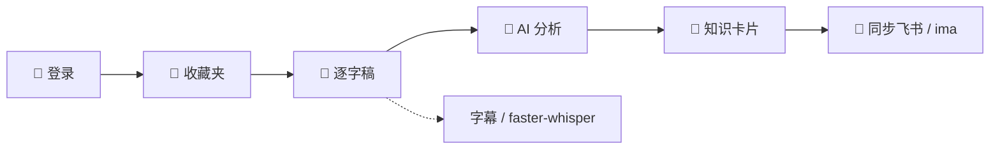
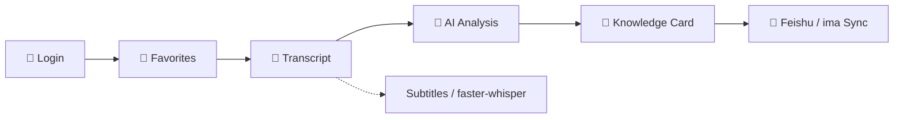

<div align="center">

# 📚 Unarchive · 解压收藏夹

### *将视频收藏转化为个人知识库*
### *Turn Video Favorites into a Personal Knowledge Base*

<br>

> 收藏了上千个视频，真正回头看过的有几个？
>
> *Thousands of videos bookmarked — how many have you actually revisited?*

<br>

[](https://www.python.org/)
[](https://www.gradio.app/)
[](https://playwright.dev/)
[](https://github.com/SYSTRAN/faster-whisper)
[]()

<br>

[**🇨🇳 中文**](#-中文) &nbsp;|&nbsp; [**🇬🇧 English**](#-english)

</div>

---

### 为什么需要它？ / Why This?

| | 😩 没有 Unarchive | 😎 有了 Unarchive |
|:---:|:---:|:---:|
| **逐字稿** | 手动听写，费时费力 | 自动提取字幕 / Whisper 转写 |
| **内容理解** | 看完就忘，只记得标题 | AI 生成摘要、关键词、核心要点 |
| **知识管理** | 收藏列表吃灰，再也找不到 | 结构化知识卡片，可搜索可回顾 |
| **跨平台** | B站、抖音各自为政 | 统一入口，一键同步到飞书 / ima 笔记 |

---

<a id="-中文"></a>

## 🇨🇳 中文

### 💡 这是什么？

**Unarchive（解压收藏夹）** 自动完成「**看视频 → 提取文字 → AI 分析 → 整理成知识**」的完整链路。你只需登录平台、选择收藏夹，剩下的全部自动完成。



### ✨ 核心特性

| | | |
|:---:|:---:|:---:|
| 🎬 **多平台**<br>Bilibili · 抖音 | 📝 **智能转写**<br>字幕优先 + Whisper 兜底 | 🤖 **AI 分析**<br>DeepSeek · 通义千问 |
| 📖 **知识卡片**<br>摘要 · 关键词 · 要点 | 🔄 **多端同步**<br>飞书 · ima 一键同步 | 🖥️ **Web 界面**<br>Gradio 实时进度 |

### 📍 当前状态

- 抖音代码后真实复测可枚举 45 个收藏夹，两个固定收藏夹分别稳定返回 4/4 和 13/14 个可访问视频；httpx 媒体主路径、缓存和签名 URL 日志保护已通过真实样本。
- 飞书与 ima 的单视频两轮幂等已通过真实 API；四卡飞书外部写入和 ima 目标文件夹切换仍需要明确的数据/目标授权。
- 固定四视频 ASR 基准中 `small/fast` 合计约 254 秒；`base` 虽快约 62%，但中文关键实体退化，因此默认仍保留 `small`，`base` 仅作为速度候选。
- 摘要与结构分析已合并为一次请求，长稿完整分块且不再静默截断；生产默认使用 `deepseek-v4-flash`，固定收藏夹四视频真实重处理 4/4 成功落卡，总耗时约 313 秒，已通过 12 分钟目标。
- 小红书目前只有未实现的适配器桩，不属于已支持平台。

后续优先级和验收门槛见 [项目路线图](PLAN.md)。

### 📋 知识卡片示例

每个视频处理后，会生成如下结构化知识卡片：

```json
{
  "video_id": "BV1Ab4y1r7bo",
  "title": "为什么你的时间总是不够用？",
  "author": "某UP主",
  "platform": "Bilibili",
  "summary": "视频从三个维度分析了时间管理的常见误区...",
  "keywords": ["时间管理", "效率", "优先级", "番茄工作法"],
  "key_points": [
    "大多数人的时间管理问题本质是优先级问题",
    "番茄工作法的核心不是计时而是单任务专注",
    "学会说'不'比学会规划更重要"
  ]
}
```

### 🚀 快速开始

**环境要求：** Python 3.10+ · FFmpeg · Google Chrome · 可选 CUDA GPU（加速 Whisper）

```bash
# 克隆 & 安装
git clone <repo-url> && cd Unarchive
python -m venv venv && venv\Scripts\activate   # 可选：虚拟环境；依赖已装在系统 Python 时可跳过
pip install -r requirements.txt
playwright install chromium

# 配置 & 运行
cp .env.example .env   # 编辑 .env 填入 API Keys
python app.py          # 访问 http://127.0.0.1:7860
```

> **💡 CDP 自动连接：** 程序启动后会自动查找并拉起 Chrome，复用浏览器已有的登录态（免去扫码登录的麻烦）。Chrome 未安装或路径特殊时，可设置 `CHROME_PATH` 环境变量手动指定路径。服务器部署设 `CHROME_HEADLESS=1` 启用无头模式。

**配置项（`.env`）：**

| 变量 | 说明 | 默认值 |
|------|------|--------|
| `LLM_API_KEY` | 大模型 API Key | *必填* |
| `LLM_BASE_URL` | API 地址 | `https://api.deepseek.com` |
| `LLM_MODEL` | 模型名称 | `deepseek-v4-flash` |
| `FEISHU_APP_ID` | 飞书 App ID | *可选，同步飞书时填写* |
| `FEISHU_APP_SECRET` | 飞书 App Secret | *可选，同步飞书时填写* |
| `IMA_CLIENT_ID` | ima OpenAPI Client ID | *可选，同步 ima 时填写* |
| `IMA_API_KEY` | ima OpenAPI API Key | *可选，同步 ima 时填写* |
| `IMA_KNOWLEDGE_BASE_ID` | ima 知识库 ID | *可选，配置后同步会加入该知识库* |
| `WHISPER_MODEL` | Whisper 模型 | `small` |
| `CHROME_PATH` | Chrome 可执行文件路径 | *自动查找* |
| `CHROME_HEADLESS` | 无头模式（`=1` 启用） | *禁用（显示窗口）* |
| `DATA_DIR` | 数据根目录（所有状态/缓存统一存放） | `./data` |
| `COOKIES_DIR` | 平台 Cookie 持久化目录 | `./data/cookies` |
| `LOGS_DIR` | 应用日志目录 | `./data/logs` |
| `CHROME_PROFILE_DIR` | Chrome CDP 用户数据目录 | `./data/chrome_profile` |
| `VIDEO_DOWNLOAD_DIR` | 视频下载目录 | `./data/videos` |

> **💡 数据目录统一管理：** 所有状态文件（cookies、日志、知识卡片、ima 同步状态）默认存放在 `./data/` 下。设置 `DATA_DIR=/custom/path` 即可一键迁移全部数据位置，也可通过单独的环境变量（如 `COOKIES_DIR`、`LOGS_DIR`）覆写特定子目录。

<br>

---

<a id="-english"></a>

## 🇬🇧 English

### 💡 What is this?

**Unarchive** automates the full pipeline: **Watch → Transcribe → Analyze → Organize**. Just log in, pick your favorites, and let it run.



### ✨ Key Features

| | | |
|:---:|:---:|:---:|
| 🎬 **Multi-Platform**<br>Bilibili · Douyin | 📝 **Smart Transcription**<br>Subtitles + faster-whisper fallback | 🤖 **AI Analysis**<br>DeepSeek · Qwen |
| 📖 **Knowledge Cards**<br>Summary · Keywords · Points | 🔄 **Multi-target Sync**<br>Feishu · ima one-click | 🖥️ **Web UI**<br>Gradio real-time progress |

### 📍 Current Status

- Real Bilibili and Douyin processing, local-card recovery, and two-round Feishu deduplication have passed acceptance checks.
- ima has automated and historical live-API evidence, but the current credentials are invalid and require a new single-video, two-round validation.
- The faster-whisper path works for short and medium samples; long-video CPU performance is not production-accepted.
- Xiaohongshu is only an unimplemented adapter stub and is not a supported platform.

See the [project roadmap](PLAN.md) for priorities and acceptance gates.

### 📋 Knowledge Card Example

Each video produces a structured knowledge card like this:

```json
{
  "video_id": "BV1Ab4y1r7bo",
  "title": "Why You Never Have Enough Time?",
  "author": "Some Creator",
  "platform": "Bilibili",
  "summary": "The video analyzes common time management mistakes from three perspectives...",
  "keywords": ["time management", "productivity", "prioritization", "pomodoro"],
  "key_points": [
    "Most time management problems are actually priority problems",
    "The core of Pomodoro is single-task focus, not timing",
    "Learning to say 'no' matters more than learning to plan"
  ]
}
```

### 🚀 Quick Start

**Prerequisites:** Python 3.10+ · FFmpeg · Google Chrome · Optional CUDA GPU (for Whisper)

```bash
# Clone & install
git clone <repo-url> && cd Unarchive
python -m venv venv && venv\Scripts\activate   # Optional: venv; skip if deps are in system Python
pip install -r requirements.txt
playwright install chromium

# Configure & run
cp .env.example .env   # Edit .env with your API Keys
python app.py          # Visit http://127.0.0.1:7860
```

> **💡 CDP Auto-Connect:** The app automatically finds and launches Chrome, reusing existing login sessions (no manual QR code scanning). Set `CHROME_PATH` to specify a custom Chrome location, or `CHROME_HEADLESS=1` for headless mode on servers.

**Configuration (`.env`):**

| Variable | Description | Default |
|------|------|--------|
| `LLM_API_KEY` | LLM API Key | *Required* |
| `LLM_BASE_URL` | API Base URL | `https://api.deepseek.com` |
| `LLM_MODEL` | Model name | `deepseek-v4-flash` |
| `FEISHU_APP_ID` | Feishu App ID | *Optional, for Feishu sync* |
| `FEISHU_APP_SECRET` | Feishu App Secret | *Optional, for Feishu sync* |
| `IMA_CLIENT_ID` | ima OpenAPI Client ID | *Optional, for ima sync* |
| `IMA_API_KEY` | ima OpenAPI API Key | *Optional, for ima sync* |
| `IMA_KNOWLEDGE_BASE_ID` | ima Knowledge Base ID | *Optional, adds note to KB on sync* |
| `WHISPER_MODEL` | Whisper model size | `small` |
| `CHROME_PATH` | Chrome executable path | *Auto-detect* |
| `CHROME_HEADLESS` | Headless mode (`=1` to enable) | *Disabled (visible)* |
| `DATA_DIR` | Data root (all state/cache in one place) | `./data` |
| `COOKIES_DIR` | Platform cookie storage | `./data/cookies` |
| `LOGS_DIR` | Application log directory | `./data/logs` |
| `CHROME_PROFILE_DIR` | Chrome CDP user data directory | `./data/chrome_profile` |
| `VIDEO_DOWNLOAD_DIR` | Video download directory | `./data/videos` |

> **💡 Unified data directory:** All state files (cookies, logs, knowledge cards, ima sync state) live under `./data/` by default. Set `DATA_DIR=/custom/path` to relocate everything at once, or override individual subdirectories via dedicated env vars (e.g. `COOKIES_DIR`, `LOGS_DIR`).

<br>

---

### 🏗️ 项目结构 / Project Structure

```
Unarchive/
├── app.py                     # Gradio 主入口 / Main entry
├── config.py                  # 配置 / Config (Pydantic + dotenv)
├── cli.py                     # CLI 命令行入口 / CLI tool
├── .env.example               # 环境变量模板 / Env template
├── requirements.txt           # 依赖 / Dependencies
├── data/
│   ├── transcripts/           # 逐字稿 / Transcripts
│   ├── audio_cache/           # 音频缓存 / Audio cache
│   ├── knowledge_base/        # 知识卡片 / Knowledge cards
│   ├── cookies/               # 浏览器 Cookie / Browser cookies
│   ├── chrome_profile/        # CDP 持久化浏览器 profile
│   ├── logs/                  # 应用日志 / Application logs
│   ├── videos/                # 下载的视频 / Downloaded videos
│   └── ima_sync_state.json    # ima 同步状态缓存 / ima sync state
├── src/
│   ├── scraper/               # 平台抓取器 / Scrapers
│   │   ├── base.py            #   ScraperBase 抽象基类
│   │   ├── douyin.py          #   抖音 / Douyin (CDP + API拦截)
│   │   └── bilibili.py        #   B站 / Bilibili
│   ├── platforms/             # 旧版平台适配 / Legacy adapters
│   │   └── bilibili.py
│   ├── transcript/            # 逐字稿 / Transcripts
│   │   ├── subtitle.py        #   字幕解析 / Subtitle parser
│   │   └── whisper_asr.py     #   语音识别 / Whisper ASR
│   ├── analyzer/              # AI 分析 / Analysis
│   │   └── llm_analyzer.py
│   ├── sync/                  # 同步 / Sync
│   │   ├── feishu.py
│   │   └── ima.py
│   └── utils/                 # 工具 / Utilities
│       ├── cdp.py             #   CDP Chrome 连接 & 自动拉起
│       ├── video_download.py  #   视频下载 / Video download
│       ├── douyin_signer.py   #   抖音签名 / Douyin signing
│       └── common.py          #   公共工具 / Common utils
└── prompts/                   # Prompt 模板 / Templates
    ├── analyze.txt
    └── summarize.txt
```

### 🛠️ 技术栈 / Tech Stack

| 组件 / Component | 技术 / Technology |
|:---:|------|
| 🖥️ 界面 / UI | **Gradio 6.x** |
| 🌐 浏览器 / Browser | **Playwright** + **Chrome CDP**（自动拉起/复用登录态） |
| 🎵 音频 / Audio | **yt-dlp** + **faster-whisper**（CTranslate2） |
| 🌍 网络 / HTTP | **httpx** |
| ⚙️ 配置 / Config | **Pydantic** + **python-dotenv** |
| 🧠 模型 / AI | **DeepSeek** / **Qwen** (OpenAI-compatible) |

<br>

---

<div align="center">

**⭐ 觉得有用？给项目点个星吧！ / Find it useful? Give it a star!**

</div>
