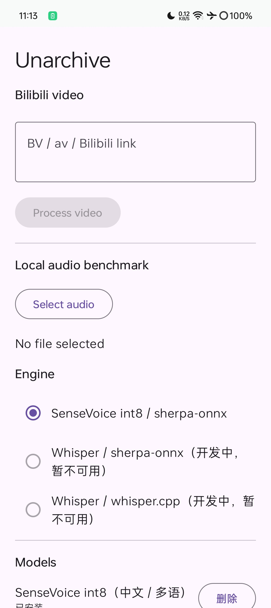
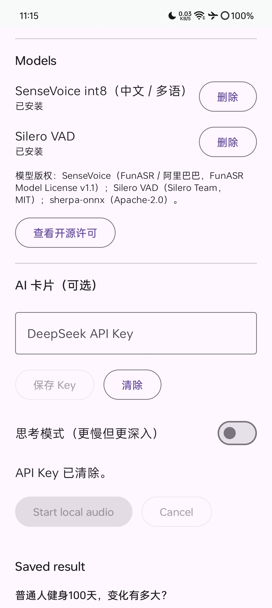
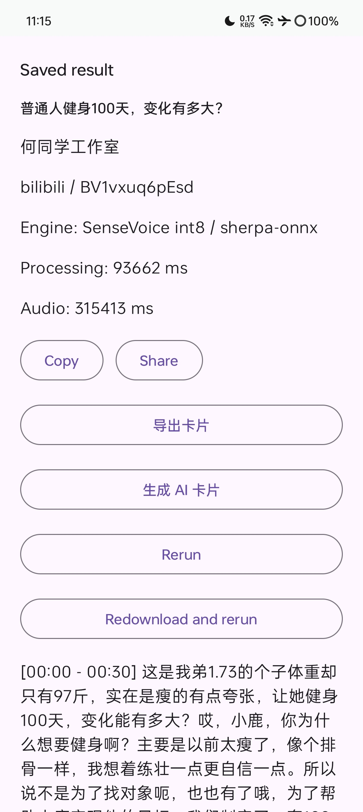
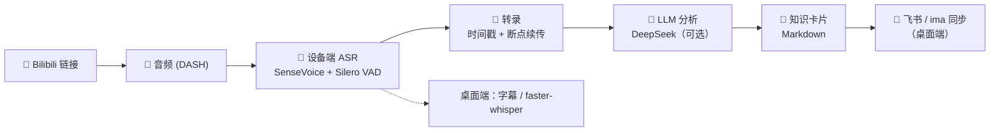

<div align="center">

# 📚 Unarchive · 解压收藏夹

### 将视频收藏转化为个人知识库

> 收藏了上千个视频，真正回头看过的有几个？
>
> *Thousands of videos bookmarked — how many have you actually revisited?*

<br>

[](https://github.com/YAHU2024/Unarchive/releases)
[](https://github.com/YAHU2024/Unarchive)
[](https://www.python.org/)
[](https://kotlinlang.org/)
[](LICENSE)
[](https://github.com/YAHU2024/Unarchive/releases)
[](https://github.com/YAHU2024/Unarchive)

<br>

[**🇨🇳 中文**](#中文) &nbsp;|&nbsp; [**🇬🇧 English**](README.md)

</div>

---

<a id="中文"></a>

## 这是什么？

**Unarchive（解压收藏夹）** 把你的视频收藏变成结构化、可检索的知识。在 Android
上粘贴一个 B 站链接——或运行桌面应用——Unarchive 自动完成剩下的步骤：
获取音频 → 设备端转写 → AI 分析 → 导出知识卡片。

**本地优先。你的视频永远属于你。** 转写在手机或电脑上完成，无需云端账号。

<br>

| | | |
|:---:|:---:|:---:|
|  |  |  |
| **① 粘贴 Bilibili 链接**<br/><sub>下方可选引擎、查看本地模型状态</sub> | **② 模型与 API 管理**<br/><sub>内置 ASR 模型本地安装，SHA-256 校验</sub> | **③ 带时间戳的转录**<br/><sub>复制、分享、重跑或导出知识卡片</sub> |

<p align="center"><em>Android 应用：粘贴链接 → 设备端转写 → 知识卡片。全部本地完成。</em></p>

---

## 🚀 快速体验

### 📱 Android — 1 分钟上手

1. 从 **[GitHub Releases](https://github.com/YAHU2024/Unarchive/releases)** 下载最新 APK（Android 8.0+，约 280 MB，已签名）
2. 安装后打开，粘贴一个 Bilibili 链接
3. 首次启动自动在本地安装内置 ASR 模型（无需联网）
4. 获得带时间戳的转录 → 导出 Markdown 知识卡片

### 🖥️ 桌面端 — 两条命令跑起来

```bash
pip install -r requirements.txt && playwright install chromium
python app.py          # 访问 http://127.0.0.1:7860
```

---

## ✨ 核心特性

| | | |
|:---:|:---:|:---:|
| 📱 **移动端优先**<br>B 站链接 → 设备端转写 | 🧠 **设备端 ASR**<br>SenseVoice int8 + Silero VAD，不依赖云端 | 🏷️ **知识卡片**<br>Markdown，Obsidian 友好 |
| 🤖 **AI 增强卡片**<br>DeepSeek 摘要 · 故事线 · 要点 | 🔄 **多端同步**<br>飞书 · ima（桌面端） | 🔒 **本地优先 · 隐私**<br>模型内置，SHA-256 校验 |
| 📼 **4 小时输入**<br>流式管线，断点续传 | 🎬 **多平台**<br>Bilibili · 抖音（桌面端） | 📤 **随处分享**<br>导出 / 复制 / 系统分享 |

---

## 📖 知识卡片示例

每个视频都会变成一张结构化 Markdown 卡片——导入 Obsidian 或任意 Markdown
笔记应用：

```markdown
---
title: "普通人健身100天，变化有多大？"
author: "何同学工作室"
source: https://www.bilibili.com/video/BV1vxuq6pEsd
transcribed: 2026-08-13
---

# 普通人健身100天，变化有多大？

## 摘要
该视频记录了一位瘦弱男性通过100天增肌计划的训练变化……

## 故事线
### 00:00–00:30 目标设定与计划制定
- [00:00](https://www.bilibili.com/video/BV1vxuq6pEsd?t=0) 主角小鹿身材瘦弱，体重97斤，设定100天健身目标。
### 00:30–01:30 初始体能测试与开始训练
- [00:30](https://www.bilibili.com/video/BV1vxuq6pEsd?t=30) 测试初始：30公斤深蹲只能做半个……

## 关键要点
- 制定100天增肌计划，训练分胸背和臀腿，三天一循环……

## 转录全文
[00:00](https://www.bilibili.com/video/BV1vxuq6pEsd?t=0) 这是我弟1.73的个子体重却只有97斤……
```

每个章节都内嵌**该时间点的视频截图**，随时跳回视频对应时刻。完整示例见
[知识卡片示例](docs/examples/普通人健身100天，变化有多大？.md)（含内嵌截图）。

> 💡 时间戳都是可点击链接，直接跳回 B 站视频的对应时间点。

---

## 🏗️ 架构



**Android**：本地优先，全部处理在设备端完成（ASR、VAD、卡片导出）。
**桌面端**：完整管线，含平台爬虫、faster-whisper、飞书 / ima 同步。

---

## 🎯 平台支持

| 平台 | Android | 桌面端 |
|:---|:---:|:---:|
| Bilibili | ✅ | ✅ |
| 抖音 | 计划中 | ✅ |
| 小红书 | — | 计划中（仅桩代码） |
| 飞书 / ima 同步 | 计划中 | ✅ |

---

## 📦 快速开始

### Android

环境要求：Android 8.0+ · 约 280 MB 可用空间

```text
1. 从 GitHub Releases 下载 unarchive-v0.1.0.apk
2. 安装（如提示，允许"未知来源"）
3. 粘贴 Bilibili 链接，点击 "Process video"
4. 首次启动自动安装内置模型到私有存储（SHA-256 校验）
```

从源码构建：见 [`android/README.md`](android/README.md)
（需要 JDK 17 + Android SDK Platform 35）。

### 桌面端

**环境要求：** Python 3.10+ · FFmpeg · Google Chrome · 可选 CUDA GPU

```bash
git clone https://github.com/YAHU2024/Unarchive.git && cd Unarchive
python -m venv venv && venv\Scripts\activate   # 可选：虚拟环境
pip install -r requirements.txt
playwright install chromium
cp .env.example .env                            # 编辑 .env 填入 API Keys
python app.py                                   # 访问 http://127.0.0.1:7860
```

> 💡 **CDP 自动连接：** 桌面应用会自动查找并拉起 Chrome，复用已有登录态
> （免扫码）。设置 `CHROME_PATH` 指定自定义 Chrome，服务器部署设
> `CHROME_HEADLESS=1` 启用无头模式。所有状态数据统一存放在 `DATA_DIR`
> （默认 `./data`）——设置一个变量即可整体迁移 cookies、日志、卡片与
> 同步状态。

完整环境变量列表见 [`.env.example`](.env.example)。

---

## 🛠️ 技术栈

| 组件 | 技术 |
|:---:|---|
| 📱 Android 应用 | **Kotlin · Jetpack Compose · sherpa-onnx** |
| 🎵 设备端 ASR | **SenseVoice int8 · Silero VAD**（sherpa-onnx） |
| 🤖 LLM | **DeepSeek**（OpenAI 兼容） |
| 🖥️ 桌面端 UI | **Gradio 6.x** |
| 🌐 桌面端浏览器 | **Playwright + Chrome CDP** |
| 🎵 桌面端 ASR | **yt-dlp + faster-whisper（CTranslate2）** |
| 🔄 桌面端同步 | **飞书 · ima（OpenAPI）** |

---

## 🙏 开源鸣谢

本项目站在以下开源项目的肩膀上，衷心感谢所有贡献者：

| 项目 | 用途 | 许可 |
| --- | --- | --- |
| [Gradio](https://github.com/gradio-app/gradio) | 桌面端 Web 界面 | Apache-2.0 |
| [Playwright](https://github.com/microsoft/playwright) | 浏览器自动化 | Apache-2.0 |
| [yt-dlp](https://github.com/yt-dlp/yt-dlp) | 媒体获取 | Unlicense |
| [faster-whisper](https://github.com/SYSTRAN/faster-whisper) | 桌面端 ASR | MIT |
| [CTranslate2](https://github.com/OpenNMT/CTranslate2) | 推理后端 | MIT |
| [httpx](https://github.com/encode/httpx) | HTTP 客户端 | BSD-3-Clause |
| [Pydantic](https://github.com/pydantic/pydantic) | 配置与校验 | MIT |
| [sherpa-onnx](https://github.com/k2-fsa/sherpa-onnx) | 设备端 ASR 引擎 | Apache-2.0 |
| [SenseVoice](https://github.com/FunAudioLLM/SenseVoice) | 语音识别模型 | FunASR Model License v1.1 |
| [Silero VAD](https://github.com/snakers4/silero-vad) | 语音活动检测 | MIT |
| [ONNX Runtime](https://github.com/microsoft/onnxruntime) | 模型推理运行时 | MIT |
| [AndroidX / Jetpack Compose](https://developer.android.com/jetpack) | Android UI 与运行时 | Apache-2.0 |
| [Kotlin](https://kotlinlang.org/) | Android 语言 | Apache-2.0 |
| [SubtitleEditforAndroid](https://github.com/nihaina/SubtitleEditforAndroid) | 参考实现（模型管理流程） | GPL-3.0 |

完整依赖清单与许可证文本见 [`THIRD_PARTY_NOTICES.md`](THIRD_PARTY_NOTICES.md)。
Android APK 内亦随附全部许可全文（应用内「查看开源许可」）。

---

## 🗺️ 路线图

- **Android**：抖音支持、飞书同步、设备端性能优化
- **桌面端**：持续维护；平台爬虫与同步功能先在桌面端落地
- 详细优先级维护在项目的私有开发文档中

---

## License / 许可证

Unarchive 采用 [GNU General Public License v3.0](LICENSE)。
第三方组件保留各自的许可证——见
[`THIRD_PARTY_NOTICES.md`](THIRD_PARTY_NOTICES.md)。

<br>

<div align="center">

**⭐ 觉得有用？给项目点个星吧！**
<br>
**⭐ Found it useful? Give the project a star!**

</div>
